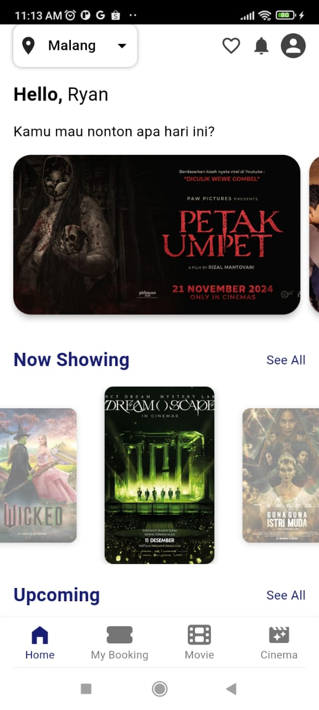
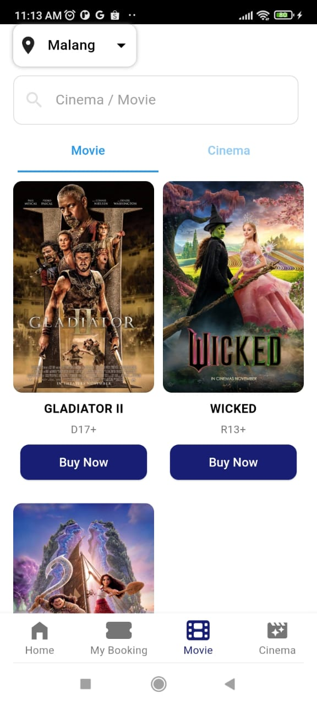

# Cinepolis App

Cinepolis App adalah aplikasi mobile yang memungkinkan pengguna untuk melihat jadwal film, membeli tiket, serta menemukan bioskop terdekat di jaringan bioskop Cinepolis. Aplikasi ini memudahkan pengguna untuk menikmati pengalaman menonton film yang lebih nyaman dengan berbagai fitur yang terintegrasi.
 
## Fitur Utama

1. **Jadwal Film**  
   Pengguna dapat melihat jadwal film yang tersedia di bioskop Cinepolis terdekat.

2. **Pencarian Bioskop Terdekat**  
   Aplikasi memungkinkan pengguna untuk mencari lokasi bioskop Cinepolis yang paling dekat dengan lokasi mereka.

3. **Pembelian Tiket**  
   Pengguna dapat membeli tiket untuk film pilihan mereka langsung melalui aplikasi, termasuk pemilihan kursi.

4. **Notifikasi Film Terbaru**  
   Pengguna akan mendapatkan informasi mengenai film-film terbaru yang tayang di bioskop Cinepolis.

5. **Desain User-Friendly**  
   Aplikasi dirancang dengan antarmuka yang sederhana dan mudah digunakan.

## Prasyarat

Untuk menjalankan aplikasi ini, pastikan Anda memiliki:

- Android 5.0 (Lollipop) atau versi lebih tinggi
- Koneksi internet yang stabil
- Akun Cinepolis (opsional, jika diperlukan untuk pembelian tiket)

## Instalasi

### 1. Clone Repository

Clone repository ini ke dalam direktori lokal Anda:

```bash
git clone https://github.com/username/cinepolis-app.git
```

### 2. Install Dependencies

Jika menggunakan Flutter, pastikan Anda telah menginstal Flutter SDK dan mengonfigurasi lingkungan pengembangan.

Install dependencies dengan perintah:

```bash
flutter pub get
```

### 3. Menjalankan Aplikasi

Untuk menjalankan aplikasi di emulator atau perangkat fisik, gunakan perintah:

```bash
flutter run
```

## Cara Penggunaan

1. **Buka Aplikasi**  
   Setelah aplikasi dibuka, Anda akan disambut dengan layar utama yang menampilkan daftar film yang sedang tayang.

2. **Pilih Film**  
   Pilih film yang ingin Anda tonton, lalu pilih jadwal tayang yang tersedia.

3. **Cari Bioskop Terdekat**  
   Aplikasi secara otomatis akan mencari bioskop Cinepolis terdekat berdasarkan lokasi Anda.

4. **Beli Tiket**  
   Pilih kursi yang tersedia dan lanjutkan ke pembayaran untuk membeli tiket.

5. **Nikmati Film**  
   Setelah tiket berhasil dibeli, Anda dapat langsung menuju bioskop untuk menikmati film.

## Teknologi yang Digunakan

- **Flutter**: Untuk pengembangan aplikasi mobile (Android & iOS).
- **Firebase**: Untuk otentikasi pengguna dan penyimpanan data.
- **Geoapify API**: Untuk mencari lokasi bioskop terdekat.

## Kontribusi

Jika Anda ingin berkontribusi pada aplikasi ini, Anda dapat mengikuti langkah-langkah berikut:

1. Fork repository ini.
2. Buat cabang (branch) baru.
3. Lakukan perubahan dan commit.
4. Kirim pull request (PR).

## Lisensi

Aplikasi ini dilisensikan di bawah [MIT License](LICENSE).
